# Asmdef Graph

## Overview

`unity_zero` ships 28 runtime asmdefs (plus 2 test asmdefs). Dependencies form a strict DAG — Gameplay / Meta / UI are peers and never reference each other; the composition root `Zero.Bootstrap` is the only asmdef that references all three. Cross-tier coupling between peers goes through `IEventBus`.

## Public API

This document is the read-only authoritative diagram of the asmdef DAG. To verify, run:

```bash
find Assets/_Project/Scripts/Runtime -name "*.asmdef" | xargs -n1 -I{} sh -c 'echo "==> {}"; cat "{}"'
```

The graph below is built from the `references` field of each `.asmdef`.

## Diagram

```mermaid
graph TD
    Core[Zero.Core]
    Infra[Zero.Infrastructure]

    Events[Zero.Services.Events]
    Log[Zero.Services.Log]
    Save[Zero.Services.Save]
    Asset[Zero.Services.Asset]
    Pool[Zero.Services.Pool]
    Scene[Zero.Services.Scene]
    Time[Zero.Services.Time]
    DeviceProfile[Zero.Services.DeviceProfile]
    Localization[Zero.Services.Localization]

    Crashlytics[Zero.Services.Crashlytics]
    Consent[Zero.Services.Consent]
    RemoteConfig[Zero.Services.RemoteConfig]
    Analytics[Zero.Services.Analytics]
    Attribution[Zero.Services.Attribution]
    Ads[Zero.Services.Ads]
    AdPlacement[Zero.Services.AdPlacement]
    IAP[Zero.Services.IAP]
    Receipt[Zero.Services.ReceiptValidator]
    Audio[Zero.Services.Audio]
    Input[Zero.Services.Input]
    Notification[Zero.Services.Notification]
    VersionCheck[Zero.Services.VersionCheck]

    UI[Zero.UI]
    Meta[Zero.Meta — empty placeholder]
    Gameplay[Zero.Gameplay]

    DevTools[Zero.DevTools — UNITY_EDITOR or DEVELOPMENT_BUILD only]
    Bootstrap[Zero.Bootstrap]

    Core --> Infra

    Infra --> Events
    Infra --> Log
    Infra --> Save
    Infra --> Asset
    Infra --> Pool
    Infra --> Scene
    Infra --> Time
    Infra --> DeviceProfile
    Infra --> Localization
    Infra --> Crashlytics
    Infra --> Consent
    Infra --> RemoteConfig
    Infra --> Analytics
    Infra --> Attribution
    Infra --> Ads
    Infra --> AdPlacement
    Infra --> IAP
    Infra --> Receipt
    Infra --> Audio
    Infra --> Input
    Infra --> Notification
    Infra --> VersionCheck

    Events --> UI
    Events --> Gameplay
    Events --> Meta
    Events --> VersionCheck

    UI --> Bootstrap
    Meta --> Bootstrap
    Gameplay --> Bootstrap
    Events --> Bootstrap
    Save --> Bootstrap
    Audio --> Bootstrap
    Input --> Bootstrap
    Notification --> Bootstrap
    VersionCheck --> Bootstrap

    Core --> DevTools
```



The graph above is illustrative — only key edges shown for readability. Every asmdef references `Zero.Core` either directly or transitively. Most service asmdefs reference `Zero.Infrastructure` (for `BootstrapStepBase`).

## Tier breakdown

### Tier 1 — `Zero.Core` (interfaces + POCOs)

References: `UniTask`, `R3`. No project-internal asmdef references.

Holds: every `I*Service` interface, cross-cutting event POCOs (`AppPaused`, `AppQuitting`), `IBootstrapStep`, `IBootstrapProgressReporter`. No implementations.

### Tier 2 — `Zero.Infrastructure`

References: `Zero.Core`, `UniTask`, `R3`.

Holds: `BootstrapStepBase`, `BootstrapPipeline`, `BootstrapProgressReporter`. The pipeline is constructed via Reflex factory in `Zero.Bootstrap.ProjectScopeInstaller`; the steps array there is the source of truth for execution order.

### Tier 3 — Services (one asmdef per service)

22 service asmdefs. Each follows the same shape: references `Zero.Core` + `Zero.Infrastructure` + whatever third-party packages the impl needs (`Unity.Localization`, `LitMotion`, `Unity.InputSystem`, `Unity.Notifications.Unified`, etc.).

**Two services reference `Zero.Services.Events`** because their behavior emits or subscribes to bus events:
- `Zero.Services.VersionCheck` — checks against remote-config keys, may emit a status event in future.
- (Anywhere else that needs to emit bus events from inside an installer or step.)

Other services do not depend on the bus directly — they expose their own R3 observables and consumers wire those up.

### Tier 4 — Peers

- `Zero.UI` — references `Zero.Core`, `Zero.Infrastructure`, `Zero.Services.Events`, plus `Zero.Services.Asset` (for popup/screen/toast prefab loading) and `Zero.Services.Localization` (for `LocalizedText`). Plus `LitMotion`, `Unity.TextMeshPro`, `Unity.Addressables`.
- `Zero.Meta` — empty placeholder. References: `Zero.Core`, `Zero.Infrastructure`, `Zero.Services.Events`. No impl ships; consumer fills.
- `Zero.Gameplay` — references `Zero.Core`, `Zero.Infrastructure`, `Zero.Services.Events`, `UniTask`, `R3`, `Reflex`, `LitMotion`. **Does NOT reference `Zero.UI` or `Zero.Meta`** — peer rule. Verify with `grep "Zero.UI\\|Zero.Meta" Assets/_Project/Scripts/Runtime/Gameplay/Zero.Gameplay.asmdef` (must return empty).

### Tier 5 — Composition root

- `Zero.Bootstrap` — references **all 22 services + all 3 peers + Reflex**. Only asmdef where Gameplay, Meta, UI all sit in scope simultaneously — needed to wire the steps array and DI bindings.

### Aux — `Zero.DevTools`

- `Zero.DevTools` — references `Zero.Core`, `Unity.InputSystem`, `UniTask`, `Reflex`, `R3`. Asmdef-level `defineConstraints: ["UNITY_EDITOR || DEVELOPMENT_BUILD"]` so the assembly is omitted entirely from production builds. Spawned via `[RuntimeInitializeOnLoadMethod(AfterSceneLoad)]` in `DevToolsBootstrap`. Does NOT reference `Zero.Bootstrap` — DevTools commands resolve services through `Container.RootContainer.Construct(Type)` at runtime, not via constructor injection from the composition root.

## Test asmdefs

- `Zero.Tests.EditMode` — `includePlatforms: ["Editor"]`, `defineConstraints: ["UNITY_INCLUDE_TESTS"]`. References every asmdef whose tests live in this module. Currently: Core, Infrastructure, Events, Save, Pool, Log, Audio, Notification, Input, Localization, RemoteConfig, VersionCheck, DevTools, UI, Gameplay, Bootstrap.
- `Zero.Tests.PlayMode` — empty asmdef placeholder. CI is EditMode-only per `PLAN.md` §2.13.

## Extension Points

When adding a new service:

1. New asmdef under `Assets/_Project/Scripts/Runtime/Services/<Name>/Zero.Services.<Name>.asmdef`.
2. References listed by **string name**, not GUID. Mirror an existing asmdef.
3. `autoReferenced: false`.
4. Add the new asmdef to `Zero.Bootstrap.asmdef.references` so the composition root can wire it.
5. Add to `Zero.Tests.EditMode.asmdef.references` if the service has tests.

When adding a peer-internal feature (Gameplay / UI / Meta), do **not** add a cross-peer reference. Instead emit / subscribe a bus event under `Zero.Services.Events`. The reviewer flags any direct peer-to-peer ref.

## Examples

The `Zero.Services.VersionCheck` asmdef is the most recent, shaped to repo convention:

```json
{
    "name": "Zero.Services.VersionCheck",
    "rootNamespace": "Zero.Services.VersionCheck",
    "references": [
        "Zero.Core",
        "Zero.Infrastructure",
        "Zero.Services.Events",
        "UniTask",
        "Reflex"
    ],
    "autoReferenced": false,
    "includePlatforms": [],
    "excludePlatforms": [],
    "allowUnsafeCode": false,
    "overrideReferences": false,
    "precompiledReferences": [],
    "defineConstraints": []
}
```

## Known Limitations

- 28 asmdefs is verbose. Codex review historically flags this. Defense: each asmdef boundary protects the layer-rule (Core / Infrastructure / Service / Peer / Composition) and lets consumers strip optional services (e.g. drop `Zero.DevTools` from a production build by deleting the folder, or drop `Zero.Services.VersionCheck` if the game has no live-ops). Consolidating by tier (one giant `Zero.Services` asmdef) would lose the strip-ability.
- Asmdef GUIDs are NOT used for references in this repo — every reference is a string name. Mixing GUIDs with strings (or fabricating GUIDs) silently breaks the build. PITFALLS calls this out.
- `Zero.Meta.asmdef` is real but empty — exists so consumer code has a peer-tier asmdef to land in without modifying the template's structure.

## Design Rationale

- **Peer rule** — Gameplay / Meta / UI as peers (rather than UI depending on Gameplay, or Gameplay depending on Meta) means each tier can be substituted per-game without breaking the others. Hybrid casual vs puzzle have radically different meta loops; locking Meta into a UI dependency would force every game to rewrite UI when Meta changes shape. The bus is the universal seam.
- **`Zero.DevTools` as separate ifdef-gated asmdef** — defineConstraint at asmdef level is stronger than per-file `#if`. The assembly literally does not compile in production builds, so devtools can never be activated by accident (e.g. via reflection or string lookup).
- **Composition root stays at `Zero.Bootstrap`** — not split per-feature. Bootstrap is the *only* place where the full DAG is visible; splitting it would require a parent installer pattern and consumers would have to remember which sub-installer wires which service. One file, ordered list, end of story.
